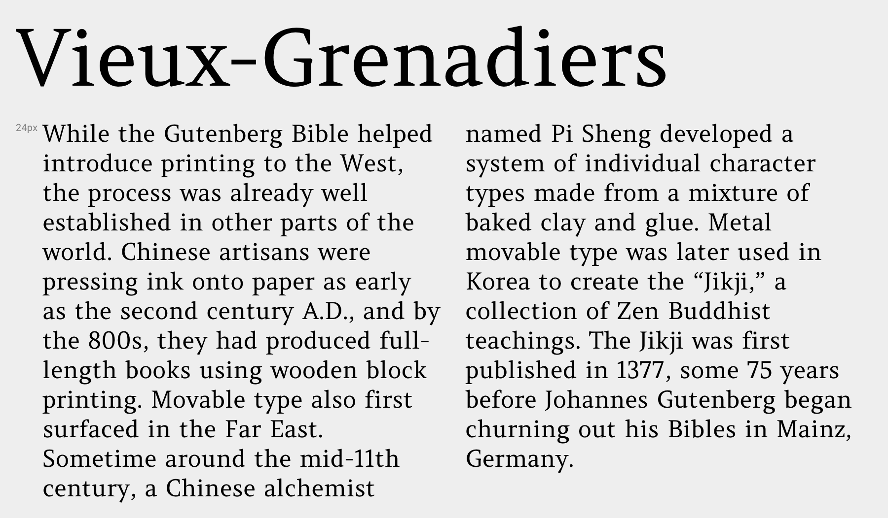

Amethysta was designed by Konstantin Vinogradov 
with the purpose of printing on low quality paper in mind.
This is why it has such minimalistic wedge serifs and terminals.
It builds the impression of a simple and strong text typeface.
In terms of proportions it is closely related to the transitional 
serif group.

Amethysta is suitable for small to medium sizes, while some details
will be noticeable at larger sizes. It also will work well in print.

Amethysta is a Unicode typeface family that supports 
languages that use the Latin script and its variants, and 
could be expanded to support other scripts.

